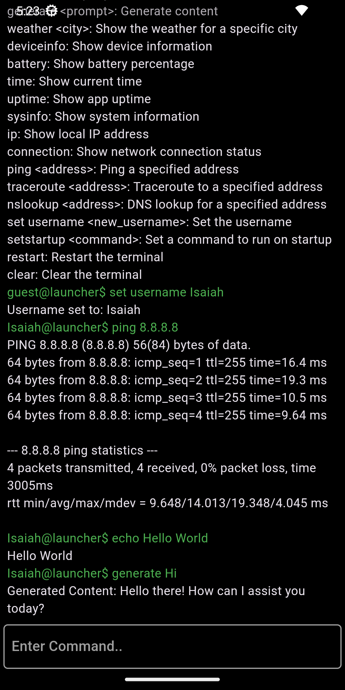

# Terminal Launcher

A Flutter-based terminal launcher application for Android that provides command-line functionality to manage installed apps and access device information.



## Commands

Here are the available commands you can use in the terminal:

- `help`: Show the help message
- `echo <message>`: Display the message
- `list`: List installed apps
- `run <app name>`: Run a specific app
- `websearch <query>`: Search in the browser
- `generate <prompt>`: Generate content using the Gemini API
- `weather <city>`: Show the weather for a specific city
- `deviceinfo`: Show device information
- `battery`: Show battery percentage
- `volume up/down`: Increase or decrease volume by 10%
- `volume <0-100>`: Set volume to a specific level
- `brightness up/down`: Increase or decrease brightness by 10%
- `brightness <0-100>`: Set brightness to a specific level
- `flashlight on/off:` Toggle the flashlight
- `time`: Show current time
- `uptime`: Show app uptime
- `sysinfo`: Show system information
- `ip`: Show local IP address
- `connection`: Show network connection status
- `ping <address>`: Ping a specified address
- `traceroute <address>`: Traceroute to a specified address
- `nslookup <address>`: DNS lookup for a specified address
- `set username <new_username>`: Set the username
- `setstartup <command>`: Set a command to run on startup
- `restart`: Restart the terminal
- `clear`: Clear the terminal

## Getting Started

### Prerequisites

- Flutter SDK
- Dart SDK
- Android device or emulator

### Installation

1. Clone the repository:
   ```bash
   git clone <repository-url>
    ```

2. Navigate to the project directory:
    ```bash
    cd terminal_launcher
    ```

3. Install the dependencies:
    ```bash
    flutter pub get
    ```

4. Run the application:
    ```bash
    flutter run
    ```

### Environment Variables

Make sure to create a .env file in the root of your project with the following variable:
    ```
    OPENWEATHER_API_KEY=<your_openweather_api_key>
    API_KEY=<your_gemini_api_key>
    ``` 

## Usage

After launching the app, you can start typing commands in the input field at the bottom of the screen. Press "Enter" to execute a command. You can list all available commands by typing ```help.```.

## Contributing

Contributions are welcome! Please open an issue or submit a pull request.
